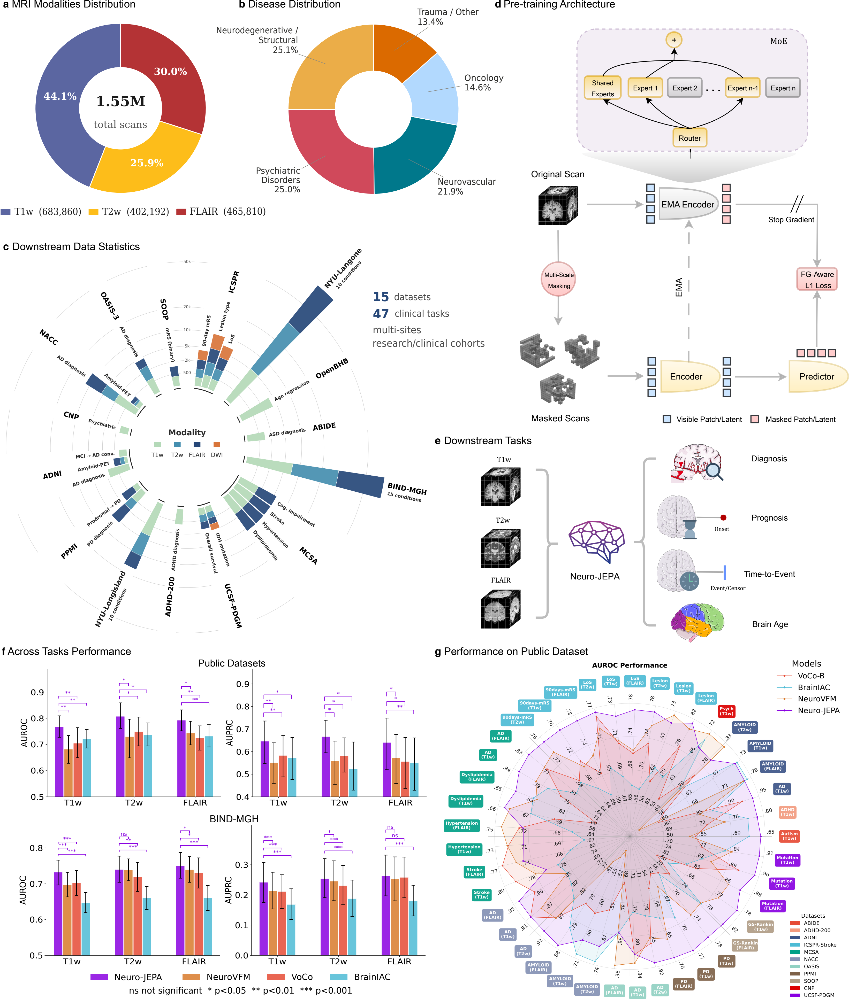
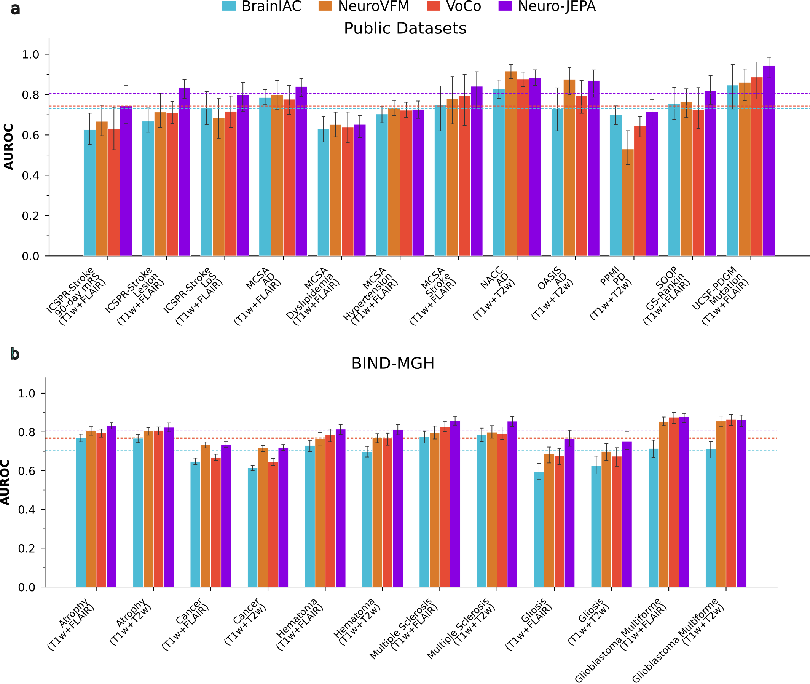
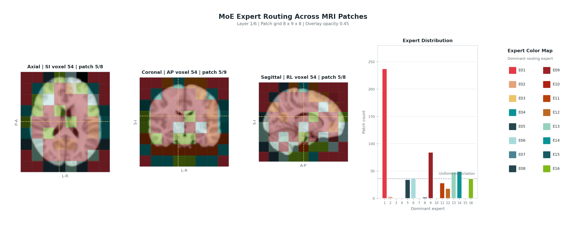
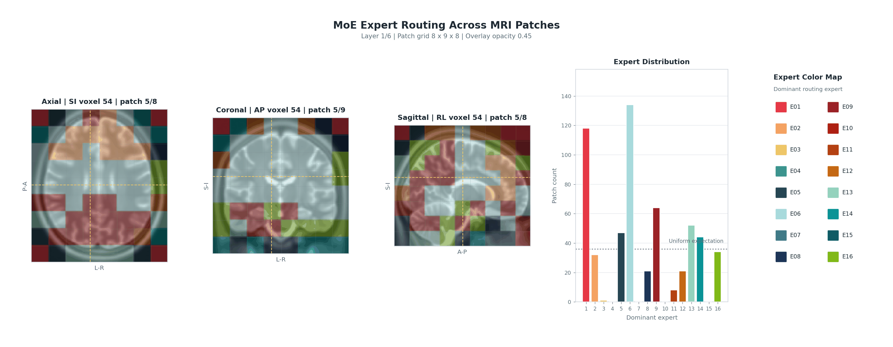
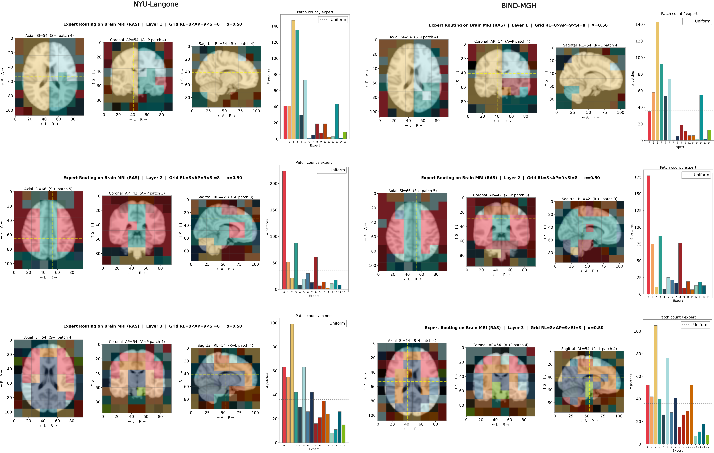

# Neuro-JEPA: Learning Sparse Latent Predictive Foundation Model for Multimodal Neuroimaging
<div align="center">

 [](https://creativecommons.org/licenses/by-nc-nd/4.0/deed.en) [](https://opensource.org/license/MIT) [](https://www.python.org/downloads/)

📄 [Paper](https://arxiv.org/abs/xxx.xxxxx) | 🤗 [Weights](https://huggingface.co/NYUMedML/Neuro-JEPA) | 📚 [BibTeX](#citation)

</div>

## Table of Contents

- [Overview](#overview)
- [TL;DR](#tldr)
- [Repository Layout](#repository-layout)
- [Installation](#installation)
- [Quick Start](#quick-start)
  - [Weight Sharing](#weight-sharing)
  - [Pretraining](#pretraining)
  - [Pretraining Log](#pretraining-log)
  - [Fine-Tuning](#fine-tuning)
  - [Inference](#inference)
  - [Slurm Submission Scripts](#slurm-submission-scripts)
- [MRI Registration](#mri-registration)
  - [Templates](#templates)
  - [Per-Modality Pipelines](#per-modality-pipelines)
  - [Registration Dependencies](#registration-dependencies)
  - [Registration Usage](#registration-usage)
- [Benchmarking Neuro-JEPA](#benchmarking-neurojepa)
  - [Multimodal Evaluation](#multimodal-evaluation)
  - [Average Unimodal Performance](#average-unimodal-performance)
  - [Survival and Brain-Age Prediction](#survival-and-brain-age-prediction)
  - [Average Multimodal Performance](#average-multimodal-performance)
- [MoE Analysis](#moe-analysis)
- [Citation](#citation)
- [License](#license)
- [Acknowledgements](#acknowledgements)

## Overview

This repository contains the official implementation of **Neuro-JEPA**, a sparse latent predictive foundation model for multimodal volumetric neuroimaging. Neuro-JEPA extends the V-JEPA 2 predictive-embedding framework to 3D brain MRI and is pretrained on approximately **1.55 million** curated T1w, T2w, and FLAIR scans from NYU Langone Health.

The model is evaluated across one of the broadest neuroimaging benchmarks assembled for this setting: **12 public research cohorts** and **three large clinical cohorts** from NYU Langone, NYU Long Island, and Massachusetts General Hospital. Across **47 downstream tasks**, Neuro-JEPA evaluated with diagnosis, prognosis, regression, multimodal learning, and time-to-event prediction.

Neuro-JEPA combines JEPA pretraining with foreground-aware objectives, improved masking strategies, and a sparse Mixture-of-Experts backbone. In our experiments, it consistently improves over prior neuroimaging foundation models, including average gains of **4.4-6.4% AUROC** and **6.4-9.4% AUPRC** on unimodal tasks, **5.8-7.6% AUROC** and **6.2-8.5% AUPRC** on multimodal tasks, and up to **15%** improvement under few-shot settings.

Please refer to the accompanying paper for the full method, implementation details, and experimental protocol.



**Figure 1. Overview of the study.** Neuro-JEPA is pretrained on multimodal MRI data and evaluated across diagnosis, prognosis, time-to-event prediction, and age-prediction tasks. The study summarizes modality coverage, disease distributions, patient geography, model architecture, and downstream performance across public and clinical cohorts.

## TL;DR

- **Large-scale MRI pretraining:** We study the potential of latent predictive objective (JEPA) for neuroimaging representation learning at scale. The study is performed on approximately 1.55 million curated T1w, T2w, and FLAIR scans with 428,647 studies and 282,693 patients from NYU Langone hospitals.
- **3D predictive foundation model:** Volumetric encoder-predictor training with foreground-aware loss design, improved masking, and sparse Mixture-of-Experts layers.
- **Multimodal downstream support:** Code paths for unimodal and multimodal fine-tuning, Product-of-Experts fusion, regression, and time-to-event modeling.
- **Clinical and public benchmarking:** Evaluation across 47 diverse tasks from public datasets and institutional clinical cohorts.
- **End-to-end preprocessing:** SLURM-ready MRI registration scripts for aligning raw scans to MNI152 standard space.

## Repository Layout

```text
.
├── assets/                 Figures and supplementary material
├── configs/                Hydra configuration files
│   ├── finetune/
│   ├── inference/
│   ├── monitor/
│   └── pretrain/
├── datasets/               Dataset directory contains dataset splits
│   ├── unimodal/           Unimodal dataset directory contains dataset splits we used for unimodal evaluation
│   ├── multimodal/         Multimodal dataset directory contains dataset splits we used for multimodal evaluation
├── notebooks/              Notebook
│   ├── extract_feature_example.ipynb      An Example for loading model and extract features
├── registration/           MRI registration scripts and templates
│   ├── register_flair.sh
│   ├── register_t1w.sh
│   ├── register_t2w.sh
│   └── registration_templates/
├── scripts/                Entrypoints for training, inference, and SLURM jobs
│   ├── finetune/
│   │   ├── default.py      Unimodal classification/regression
│   │   ├── mm.py           Multimodal classification
│   │   ├── mm_poe.py       Product-of-Experts multimodal classification
│   │   └── tte.py          Time-to-event / survival modeling
│   ├── inference.py
│   ├── monitor.py
│   ├── pretrain.py
│   └── slurm/
|   │   ├── cooldown_neurojepa.sh
│   │   ├── pretrain_neurojepa.sh
├── src/neurojepa/          Core Python package
│   ├── data/               Datasets and transforms
│   ├── engines/            Training and evaluation loops
│   ├── loss/               JEPA and survival losses
│   ├── masks/              3D masking strategies
│   ├── models/             Encoders, predictors, heads, and MoE layers
│   └── utils/              Distributed training, logging, schedulers, and I/O
├── tools/                  Standalone utilities such as cache construction
├── LICENSE
├── pyproject.toml
├── README.md
└── requirements.txt
```

## Installation

Python 3.11 or newer is required. The training stack is designed for CUDA 12.x; see `requirements.txt` for exact package pins.

### Option 1: Python virtual environment

```bash
python -m venv .venv
source .venv/bin/activate
pip install -U pip
pip install -r requirements.txt
pip install -e .
```

On Windows, activate the environment with:

```powershell
.venv\Scripts\activate
```

### Option 2: Conda environment

```bash
conda create -n neurojepa python=3.11 -y
conda activate neurojepa
pip install -U pip
pip install -r requirements.txt
pip install -e .
```

## Quick Start

All entrypoints use Hydra. Configuration names correspond to YAML filenames under `configs/<stage>/`, without the `.yaml` suffix. Before launching jobs, update dataset paths, cache directories, output paths, and checkpoint paths in the selected config file or pass them as Hydra overrides.

### Weight Sharing

Pretrained model weights are made available upon request via Hugging Face at [HuggingFace Model Card](https://huggingface.co/NYUMedML/Neuro-JEPA). The model weights are distributed for non-commercial research purposes under the Creative Commons Attribution-NonCommercial-NoDerivatives 4.0 International License (CC BY-NC-ND 4.0).

Once the request is approved, the model weights can be loaded as

```bash
import torch
from neurojepa.utils.init_utils import load_backbone_from_hf

device = "cuda" if torch.cuda.is_available() else "cpu"

backbone = load_backbone_from_hf(
    "NYUMedML/Neuro-JEPA",
    device=device,
)
```

We present a minimal example on loading model and extracting feature on `notebooks/extract_feature_example.ipynb`.

Evaluation and fine-tuning entrypoints can load the backbone either from a local
checkpoint path or directly from Hugging Face. For example, run inference with local checkpoint or Hugging Face can be defined as follows.

Local loading remains the default:

```bash
python -m torch.distributed.run --nnodes 1 --nproc_per_node 1 --master_port 12345 \
  scripts/inference.py --config-name inference_neurojepa \
  meta.load_checkpoint=true \
  meta.checkpoint_source=local \
  meta.load_path_checkpoint=/path/to/checkpoints/latest.pt
```

To load the released Hugging Face weights instead:

```bash
python -m torch.distributed.run --nnodes 1 --nproc_per_node 1 --master_port 12345 \
  scripts/inference.py --config-name inference_neurojepa \
  meta.load_checkpoint=true \
  meta.checkpoint_source=hf \
  meta.hf_model_id=NYUMedML/Neuro-JEPA \
  meta.hf_checkpoint_filename=model.safetensors \
  meta.hf_token=true
```

### Pretraining

We show examples on running with 1 node and 1 gpu with commands as follows

First 200 epochs annealing
```bash
python -m torch.distributed.run --nnodes 1 --nproc_per_node 1 --master_port 12345 \
  scripts/pretrain.py --config-name pretrain_neurojepa_base
```

Cooldown with 40 epochs
```bash
python -m torch.distributed.run --nnodes 1 --nproc_per_node 1 --master_port 12345 \
  scripts/pretrain.py --config-name cooldown_neurojepa_base
```

Example with explicit data and checkpoint overrides:

```bash
python -m torch.distributed.run --nnodes 1 --nproc_per_node 1 --master_port 12345 \
  --config-name pretrain_neurojepa_base \
  data.train_csv_path=/path/to/pretrain.csv \
  data.cache_dir=/path/to/cache \
  meta.save_path_checkpoint=/path/to/checkpoints/neurojepa
```

### Pretraining Logs and Training Stability

To support reproducibility and provide a reference for expected training behavior, we make our pretraining logs publicly available through a Weights & Biases report: [W&B pretraining report](https://api.wandb.ai/links/notody/7t7d4dks). The full pretraining log comes from the checkpoint with best performance achieved (the checkpoint we shared).

Because the original JEPA objective uses an exponential moving average (EMA) target encoder, training can be sensitive to hyperparameter choices and may become unstable under certain dataset configurations (see an example for the related [JEPA GitHub issue](https://github.com/facebookresearch/jepa/issues/85)). If large or sustained loss spikes are observed, or if the training curve differs substantially from the logs provided here, we recommend tuning the EMA schedule, learning rate, and masking-related hyperparameters.

### Fine-Tuning

Unimodal classification or regression:

```bash
python -m torch.distributed.run --nnodes 1 --nproc_per_node 1 --master_port 12345 \
  scripts/finetune/default.py --config-name finetune_neurojepa
```

Multimodal classification:

```bash
python -m torch.distributed.run --nnodes 1 --nproc_per_node 1 --master_port 12345 \
  scripts/finetune/mm.py --config-name finetune_neurojepa_mm
```

Multimodal classification with Product-of-Experts fusion:

```bash
python -m torch.distributed.run --nnodes 1 --nproc_per_node 1 --master_port 12345 \
 scripts/finetune/mm_poe.py --config-name finetune_neurojepa_mm
```

Time-to-event / survival modeling:

```bash
python -m torch.distributed.run --nnodes 1 --nproc_per_node 1 --master_port 12345 \
 scripts/finetune/tte.py --config-name finetune_neurojepa_tte
```

### Monitoring

We monitor model performance across multiple tasks using attentive probing in a single run. For each task, the probing head with the best validation performance is saved and used for final evaluation on the test set. An example command for running the monitoring procedure is provided below:

```bash
python -m torch.distributed.run --nnodes 1 --nproc_per_node 1 --master_port 12345 \
  scripts/monitor.py --config-name monitor_t1w_nyu.yaml
```

### Slurm Submission Scripts

Reference SLURM submission scripts for multinode distributed pretraining are available in `scripts/slurm/`. The main Neuro-JEPA reference script is:

```bash
sbatch scripts/slurm/pretrain_neurojepa.sh
```

Adjust account, partition, node count, data paths, cache paths, and checkpoint locations before submission.

## MRI Registration

Neuro-JEPA is pretrained on scans registered to MNI152 standard space. For best transfer performance, we recommend applying the same registration protocol before fine-tuning or inference.

The `registration/` directory provides SLURM array scripts for aligning raw MRI scans to MNI152 space. All modalities use `fslreorient2std`, `robustfov`, N4 bias-field correction, and **12-DOF affine registration** with FSL FLIRT and spline interpolation. Update `CSV_FILE`, `OUTPUT_DIR`, and template paths at the top of each script before submitting jobs. FSL is chosen for affine registration because of its faster processing speed for our large scale studies.

### Templates

| Modality | Template | Download |
| --- | --- | --- |
| T1w | MNI152 T1 1 mm brain (`MNI152_T1_1mm_brain.nii.gz`) | [Google Drive](https://drive.google.com/file/d/1H84c-gcge5FpNIpU7gJiFB9J8ayeF-mx/view?usp=drive_link) |
| T2w / FLAIR | MNI ICBM 152 T2 nonlinear asymmetric 09c (`mni_icbm152_t2_tal_nlin_asym_09c.nii`) | [Google Drive](https://drive.google.com/file/d/1PWjTucRtyEGs1X1yl6bjSMnSb7q3ya8w/view?usp=drive_link) |

Place downloaded templates in a shared filesystem location and set the `template_img` variable in the corresponding registration script.

### Per-Modality Pipelines

**T1w** (`registration/register_t1w.sh`)

1. `fslreorient2std`: reorient to standard orientation.
2. `robustfov`: apply robust field-of-view cropping / AC-PC alignment.
3. `N4BiasFieldCorrection`: correct low-frequency intensity bias fields.
4. `mri_synthstrip`: skull-strip the bias-corrected volume.
5. `flirt`: estimate a 12-DOF affine transform to the MNI152 T1 template with correlation-ratio cost.
6. `flirt --applyxfm`: apply the transform with spline interpolation.

**T2w** (`registration/register_t2w.sh`)

1. `fslreorient2std`: reorient to standard orientation.
2. `robustfov`: apply robust field-of-view cropping / AC-PC alignment.
3. `N4BiasFieldCorrection`: correct low-frequency intensity bias fields.
4. `flirt`: estimate a 12-DOF affine transform to the MNI152 T2 template with correlation-ratio cost and +/-90 degree search ranges.
5. `flirt --applyxfm`: apply the transform with spline interpolation.
6. `mri_synthstrip`: skull-strip the registered volume.

**FLAIR** (`registration/register_flair.sh`)

1. `fslreorient2std`: reorient to standard orientation.
2. `robustfov`: apply robust field-of-view cropping / AC-PC alignment.
3. `N4BiasFieldCorrection`: correct low-frequency intensity bias fields.
4. `flirt`: estimate a 12-DOF affine transform to the MNI152 T2 template with mutual-information cost and +/-90 degree search ranges.
5. `flirt --applyxfm`: apply the transform with spline interpolation.
6. `mri_synthstrip`: skull-strip the registered volume.

### Registration Dependencies

| Tool | Version used |
| --- | --- |
| FSL | 6.0.7 |
| FreeSurfer (`mri_synthstrip`) | 7.4.1 |
| ANTs (`N4BiasFieldCorrection`) | 2.5.0 |

### Registration Usage

```bash
sbatch --array=0-9 registration/register_t1w.sh
```

Input CSVs should contain one file path per row with a header row. File names should match the array-task pattern used by the scripts, such as `T1w_<task_id>.csv`, `T2w_<task_id>.csv`, or `FLAIR_<task_id>.csv`. Registered outputs are written in a BIDS-style layout under `OUTPUT_DIR`.

## Benchmarking Neuro-JEPA
We present part of our evaluation results in this section, all dataset in the evaluation are splitted by patients. Please reference our paper for full evaluation.

### Data Splits
The dataset splits used for our evaluation are provided in the `datasets/` directory. The `datasets/unimodal` subdirectory contains splits for the unimodal learning evaluation, while the `datasets/multimodal` subdirectory contains splits for the multimodal learning evaluation.

### Multimodal Evaluation



**Figure 2. Multimodal performance and gains over unimodal baselines.** AUROC is reported for paired multimodal inputs. All results are from full fine-tuning except NeuroVFM. Dotted lines indicate mean performance across tasks. Neuro-JEPA outperforms competing foundation models on selected public datasets and the BIND-MGH cohort.

### Average Unimodal Performance

Values are reported as mean with 95% confidence intervals. Bold indicates the best result for each metric. "Combinations" denotes dataset-task-modality combinations.

| Model | Public AUROC (41 combinations) | Public AUPRC (41 combinations) | NYU AUROC (30 combinations) | NYU AUPRC (30 combinations) | LI AUROC (30 combinations) | LI AUPRC (30 combinations) | MGH AUROC (45 combinations) | MGH AUPRC (45 combinations) |
| --- | --- | --- | --- | --- | --- | --- | --- | --- |
| VoCo-B | 0.721 [0.689, 0.754] | 0.573 [0.513, 0.635] | 0.762 [0.726, 0.793] | 0.338 [0.265, 0.412] | 0.735 [0.702, 0.764] | 0.295 [0.240, 0.354] | 0.717 [0.693, 0.741] | 0.233 [0.196, 0.269] |
| BrainIAC | 0.728 [0.705, 0.751] | 0.555 [0.494, 0.618] | 0.730 [0.697, 0.761] | 0.296 [0.226, 0.370] | 0.674 [0.643, 0.704] | 0.212 [0.162, 0.266] | 0.655 [0.636, 0.673] | 0.179 [0.148, 0.211] |
| NeuroVFM | 0.741 [0.706, 0.774] | 0.585 [0.526, 0.648] | 0.772 [0.743, 0.801] | 0.343 [0.271, 0.422] | 0.739 [0.713, 0.762] | 0.217 [0.175, 0.260] | 0.725 [0.705, 0.745] | 0.237 [0.199, 0.277] |
| **Neuro-JEPA** | **0.785 [0.760, 0.811]** | **0.649 [0.588, 0.705]** | **0.825 [0.796, 0.850]** | **0.457 [0.382, 0.535]** | **0.806 [0.780, 0.828]** | **0.383 [0.322, 0.442]** | **0.741 [0.720, 0.761]** | **0.253 [0.216, 0.292]** |

### Survival and Brain-Age Prediction

For C-index and R^2, higher is better. For MAE and RMSE, lower is better.

| Model | Time-to-Event C-index (6 combinations) | Brain Age R^2 (n = 757) | Brain Age MAE, years (n = 757) | Brain Age RMSE, years (n = 757) |
| --- | --- | --- | --- | --- |
| VoCo-B | 0.663 [0.616, 0.699] | 0.111 [0.065, 0.165] | 6.22 [5.46, 6.94] | 12.03 [10.54, 13.36] |
| BrainIAC | 0.650 [0.615, 0.686] | 0.522 [0.447, 0.591] | 5.42 [4.93, 5.95] | 8.82 [7.77, 9.78] |
| NeuroVFM | 0.629 [0.584, 0.673] | 0.673 [0.611, 0.735] | 4.36 [3.91, 4.77] | 7.29 [6.35, 8.12] |
| **Neuro-JEPA** | **0.695 [0.664, 0.718]** | **0.894 [0.860, 0.917]** | **2.78 [2.56, 3.02]** | **4.15 [3.69, 4.70]** |

### Average Multimodal Performance

Values are reported as mean with 95% confidence intervals. Bold indicates the best result for each metric. "Combinations" denotes dataset-task-modality combinations.

| Model | Public AUROC (12 combinations) | Public AUPRC (12 combinations) | MGH AUROC (30 combinations) | MGH AUPRC (30 combinations) |
| --- | --- | --- | --- | --- |
| VoCo-B | 0.743 [0.698, 0.789] | 0.562 [0.443, 0.673] | 0.729 [0.701, 0.757] | 0.241 [0.194, 0.288] |
| BrainIAC | 0.730 [0.693, 0.766] | 0.552 [0.428, 0.673] | 0.684 [0.662, 0.707] | 0.203 [0.160, 0.245] |
| NeuroVFM | 0.748 [0.684, 0.804] | 0.574 [0.449, 0.685] | 0.742 [0.721, 0.765] | 0.255 [0.205, 0.305] |
| **Neuro-JEPA** | **0.805 [0.759, 0.849]** | **0.637 [0.505, 0.749]** | **0.763 [0.739, 0.789]** | **0.295 [0.248, 0.343]** |

### MoE Analysis
We empirically observed that MoE for neuroimaging can have each expert route to different brain anatomical structure with similar routing distribution as demonstrated in the below examples. The behavior is consistent across different cohorts and datasets. For more discussion details and examples, please read the MoE analysis sections in our paper.







## Citation

If this repository or the accompanying paper is useful for your research, please cite:

```bibtex
@article{huang2026neurojepa,
  title={Learning Sparse Latent Predictive Foundation Model for Multimodal Neuroimaging},
  author={Haoxu Huang, Long Chen, Jingyun Chen Jinu Hyun, James Loftus, Kara Melmed, Daniel Orringer, Jennifer Frontera, Seena Dehkharghani, Arjun Masurkar, and Narges Razavian},
  journal={arXiv preprint arXiv:xxxx.xxxxx},
  year={2026}
}
```

## License

This code is released under the [MIT License](LICENSE). The released model weights are distributed for non-commercial research purposes under the [Creative Commons Attribution-NonCommercial-NoDerivatives 4.0 International License (CC BY-NC-ND 4.0)](https://creativecommons.org/licenses/by-nc-nd/4.0/deed.en). Portions of the implementation are derived from [V-JEPA 2](https://github.com/facebookresearch/vjepa2); please also review the upstream repository for its license terms.

## Acknowledgements

This work builds on V-JEPA 2 and the broader open-source medical imaging ecosystem. We thank the maintainers of MONAI, PyTorch, Hydra, FSL, FreeSurfer, and the open neuroimaging datasets used in our experiments.
